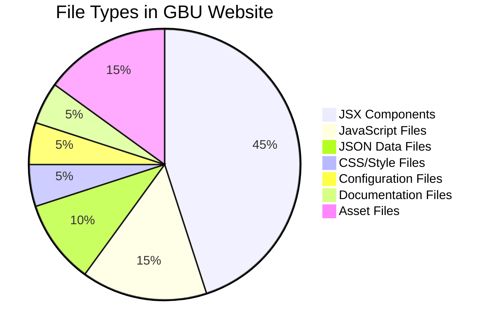
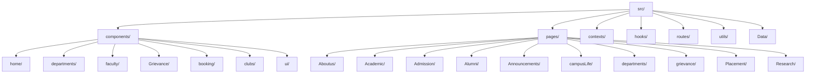

# 🎓 GBU Website - Gautam Buddha University

<div align="center">


**A comprehensive, modern university website built with React.js and Vite for Gautam Buddha University**

[🚀 Live Demo](#) • [📖 Documentation](#) • [🐛 Report Bug](#) • [💡 Request Feature](#)

</div>

---

## 📋 Table of Contents

### 🎯 [1. Project Overview](#1-project-overview)
### 🛠️ [2. Technology Stack](#2-technology-stack)
### 🏗️ [3. System Architecture](#3-system-architecture)
### 📁 [4. Project Structure](#4-project-structure)
### 🗺️ [5. Application Flow & Navigation](#5-application-flow--navigation)
### 🧩 [6. Component Architecture](#6-component-architecture)
### 🔄 [7. State Management](#7-state-management)
### 🌐 [8. API Integration](#8-api-integration)
### 📱 [9. Page-by-Page Documentation](#9-page-by-page-documentation)
### 🚀 [10. Installation & Setup](#10-installation--setup)
### 💻 [11. Development Guidelines](#11-development-guidelines)
### 🚀 [12. Deployment](#12-deployment)
### 🤝 [13. Contributing](#13-contributing)
### 📄 [14. License & Support](#14-license--support)

---

## 1. Project Overview

### 🎯 What is GBU Website?

The **Gautam Buddha University (GBU) Website** is a comprehensive digital platform that serves as the official web presence for the university. It's designed to provide seamless access to all university services, information, and resources for students, faculty, staff, and visitors.

### 🎨 Key Features & Capabilities

| Feature Category | Description | Technologies Used |
|------------------|-------------|-------------------|
| **🎓 Academic Management** | Course information, faculty profiles, research centers | React, API Integration |
| **📝 Admission System** | Application process, eligibility, fee structure | Form Handling, Validation |
| **🏠 Campus Life** | Hostel facilities, sports, clubs, food courts | Interactive Components |
| **⚖️ Administrative Services** | Grievance management, facility booking, tenders | Role-based Access |
| **🔬 Research & Innovation** | Publications, patents, incubation centers | Dynamic Content |
| **👥 Alumni Network** | Directory, success stories, mentorship | Social Features |
| **📱 Responsive Design** | Mobile-first approach | Tailwind CSS |
| **🔐 Role-based Access** | Student, Staff, Faculty, Admin dashboards | Authentication |

### 📊 System Statistics

```
🎓 GBU Website
├── 📚 Academic Pages
│   ├── 📖 Course Information
│   ├── 👨‍🏫 Faculty Profiles
│   └── 📅 Academic Calendar
├── ⚖️ Administrative Services
│   ├── 📝 Grievance System
│   ├── 🏢 Facility Booking
│   └── 📋 Tender Management
├── 🏠 Campus Life
│   ├── 🏠 Hostel Facilities
│   ├── ⚽ Sports & Clubs
│   └── 🍕 Food Courts
└── 🔬 Research & Innovation
    ├── 📄 Publications
    ├── 💡 Patents
    └── 🚀 Incubation Centers
```

### 🎯 Target Users

| User Type | Access Level | Primary Features | Device Usage |
|-----------|-------------|------------------|--------------|
| **👨‍🎓 Students** | Public + Protected | Course info, hostel booking, grievance submission | 📱 Mobile (70%), 💻 Desktop (30%) |
| **👨‍🏫 Faculty** | Protected | Faculty dashboard, research tools | 💻 Desktop (80%), 📱 Mobile (20%) |
| **👨‍💼 Staff** | Protected | Administrative tools, complaint management | 💻 Desktop (90%), 📱 Mobile (10%) |
| **👨‍💻 Admins** | Protected | System management, user administration | 💻 Desktop (95%), 📱 Mobile (5%) |
| **👥 Alumni** | Public + Protected | Alumni network, mentorship programs | 📱 Mobile (60%), 💻 Desktop (40%) |
| **🌐 Visitors** | Public | General information, announcements | 📱 Mobile (65%), 💻 Desktop (35%) |

---

## 2. Technology Stack

### 🏗️ Frontend Framework

| Technology | Version | Purpose | Documentation |
|------------|---------|---------|---------------|
| **React.js** | 19.1.0 | Core UI framework | [React Docs](https://react.dev/) |
| **Vite** | 6.3.5 | Build tool & dev server | [Vite Docs](https://vitejs.dev/) |
| **React Router DOM** | 7.6.2 | Client-side routing | [Router Docs](https://reactrouter.com/) |

### 🎨 UI & Styling

| Technology | Version | Purpose | Features |
|------------|---------|---------|----------|
| **Tailwind CSS** | 4.1.10 | Utility-first CSS framework | Responsive design, custom components |
| **Radix UI** | Latest | Accessible component primitives | Accessibility, customization |
| **Lucide React** | 0.513.0 | Icon library | 1000+ customizable icons |
| **Framer Motion** | 12.23.0 | Animation library | Smooth animations, transitions |

### 🔄 State Management & Forms

| Technology | Version | Purpose | Features |
|------------|---------|---------|----------|
| **React Context API** | Built-in | Global state management | Authentication, user data |
| **React Hook Form** | 7.61.0 | Form handling & validation | Performance, accessibility |
| **Date-fns** | 4.1.0 | Date manipulation | Lightweight, tree-shakeable |

### 🌐 HTTP Client & Data Fetching

| Technology | Version | Purpose | Features |
|------------|---------|---------|----------|
| **Axios** | 1.10.0 | HTTP client | Request/response interceptors, timeout |
| **React Query** | Latest | Data fetching & caching | Background updates, error handling |

### 🧩 UI Components & Libraries

| Technology | Version | Purpose | Features |
|------------|---------|---------|----------|
| **React Slick** | 0.30.3 | Carousel/slider | Touch support, responsive |
| **Swiper** | 11.2.8 | Modern touch slider | Mobile-first, modular |
| **React Modal** | 3.16.3 | Modal dialogs | Accessibility, focus management |
| **React DatePicker** | 8.4.0 | Date selection | Customizable, accessible |
| **Embla Carousel** | 8.6.0 | Lightweight carousel | Performance, modular |

### 🛠️ Development Tools

| Technology | Version | Purpose | Features |
|------------|---------|---------|----------|
| **ESLint** | 9.25.0 | Code linting | Custom rules, auto-fix |
| **PostCSS** | 8.5.6 | CSS processing | Autoprefixer, optimization |
| **Autoprefixer** | 10.4.21 | CSS vendor prefixing | Automatic browser support |

### 📊 Technology Stack Diagram

```
🚀 Frontend Framework
├── ⚛️ React 19.1.0
├── ⚡ Vite 6.3.5
└── 🛣️ React Router 7.6.2

🎨 UI & Styling
├── 🎨 Tailwind CSS 4.1.10
├── ♿ Radix UI
├── 🎯 Lucide React
└── ✨ Framer Motion

🔄 State & Forms
├── 🌐 React Context API
├── 📝 React Hook Form
└── 📅 Date-fns

🌐 HTTP & Data
├── 📡 Axios
└── 🔄 React Query

🧩 UI Components
├── 🎠 React Slick
├── 📱 Swiper
├── 🪟 React Modal
└── 📅 React DatePicker

🛠️ Development Tools
├── 🔍 ESLint
├── 🎨 PostCSS
└── 🔧 Autoprefixer
```

### 📱 Responsive Design Strategy

```
📱 Mobile First Approach
├── 📱 Mobile 320px-768px
├── 📱 Tablet 768px-1024px
└── 💻 Desktop 1024px+

🎯 Tailwind Breakpoints
├── 📱 sm: 640px
├── 📱 md: 768px
├── 💻 lg: 1024px
├── 💻 xl: 1280px
└── 🖥️ 2xl: 1536px

🔄 Progressive Enhancement
├── 📱 Base Mobile Styles
├── 📱 Enhanced Tablet Features
└── 💻 Full Desktop Experience
```

### 🎯 Why This Stack?

#### ✅ **React 19** - Latest Features
- **Concurrent Features**: Improved performance and user experience
- **Server Components**: Better SEO and initial load times
- **Automatic Batching**: Optimized re-renders
- **Suspense**: Better loading states

#### ✅ **Vite** - Fast Development
- **Hot Module Replacement**: Instant updates
- **ES Modules**: Native browser support
- **Optimized Build**: Tree-shaking and minification
- **Plugin Ecosystem**: Rich development tools

#### ✅ **Tailwind CSS** - Utility-First
- **Rapid Development**: Pre-built utility classes
- **Responsive Design**: Mobile-first approach
- **Customizable**: Easy theme customization
- **Performance**: Only includes used styles

#### ✅ **Modern Tooling**
- **TypeScript Ready**: Full type safety support
- **ESLint Integration**: Code quality enforcement
- **Git Hooks**: Pre-commit quality checks
- **CI/CD Ready**: Automated testing and deployment

### 📱 Responsive Design Features

| Feature | Mobile (320px-768px) | Tablet (768px-1024px) | Desktop (1024px+) |
|---------|---------------------|----------------------|-------------------|
| **Navigation** | Hamburger menu | Horizontal menu | Full navigation bar |
| **Layout** | Single column | Two columns | Multi-column grid |
| **Images** | Optimized for mobile | Medium resolution | High resolution |
| **Forms** | Stacked inputs | Side-by-side | Multi-column layout |
| **Tables** | Scrollable cards | Compact tables | Full tables |
| **Modals** | Full screen | Medium size | Standard size |
| **Typography** | 14px base | 16px base | 18px base |
| **Spacing** | Compact | Medium | Generous |

---

## 3. System Architecture

### 🏗️ High-Level Architecture

```
🌐 Client Layer
├── ⚛️ React Application
├── 🌍 Browser
└── 💾 Local Storage

🎨 Presentation Layer
├── 🧩 Components
├── 📄 Pages
└── 🏗️ Layouts

🔄 State Management
├── 🌐 Context API
├── 📊 Local State
└── 💾 Session Storage

📡 Data Layer
├── 🔌 API Services
├── 📡 Axios Client
└── 📥 Data Fetching

☁️ External Services
├── 🖥️ Backend APIs
├── 🔐 Authentication Service
└── 📁 File Storage
```

### 🔄 Real-World Data Flow Architecture

```
📱 Mobile User Journey
👤 User → 🧩 Component → 📊 State → 🔌 API → 🖥️ Backend → 🗄️ Database
   ↓         ↓           ↓         ↓         ↓           ↓
📱 Tap    📱 Update   📡 Request  🌐 HTTP   🔍 Query   📄 Return
   ↓         ↓           ↓         ↓         ↓           ↓
📱 UI      📥 Data    🔄 Update  📤 JSON    🎨 Re-render 📱 UI Update

💻 Desktop User Journey
👤 User → 🧩 Component → 📊 State → 🔌 API → 🖥️ Backend → 🗄️ Database
   ↓         ↓           ↓         ↓         ↓           ↓
💻 Input   💻 Update   📡 Request  🌐 HTTP   🔍 Query   📄 Return
   ↓         ↓           ↓         ↓         ↓           ↓
💻 UI      📥 Data    🔄 Update  📤 JSON    🎨 Re-render 💻 UI Update
```

### 🏛️ Component Architecture Pattern

```
🏠 App Level
├── ⚛️ App.jsx
├── 🛣️ Router
└── 🔐 AuthProvider

📄 Page Level
├── 🏠 Home Page
├── 📚 Academic Pages
├── ⚖️ Admin Pages
└── 👨‍🎓 Student Pages

🧩 Component Level
├── 🏗️ Layout Components
├── ⚙️ Feature Components
└── 🎨 UI Components

🔧 Service Level
├── 🔌 API Services
├── 🛠️ Utility Functions
└── 🎣 Custom Hooks
```

### 🔐 Real-World Authentication & Authorization Flow

```
👤 User Login
    ↓
🔍 Valid Credentials?
    ↓
✅ Yes → 🎫 Generate Token → 💾 Store in Context → 👤 Set User Role
    ↓
❌ No → ⚠️ Show Error
    ↓
🔄 Redirect to Dashboard
    ↓
🔒 Protected Route?
    ↓
✅ Yes → 🔐 Check Permissions → 👤 Has Permission?
    ↓                                    ↓
❌ No → ✅ Allow Access              ✅ Yes → 🎨 Render Component
    ↓                                    ↓
                                    ❌ No → 🚫 Redirect to Login
```

### 📱 Responsive Design Architecture

```
📱 Mobile First
    ↓
📱 Base Styles
    ↓
📱 Tablet Styles
    ↓
💻 Desktop Styles
    ↓
🖥️ Large Screen Styles

🎯 Tailwind Breakpoints
├── 📱 sm: 640px
├── 📱 md: 768px
├── 💻 lg: 1024px
├── 💻 xl: 1280px
└── 🖥️ 2xl: 1536px
```

### 🚀 Performance Optimization Strategy

| Optimization Type | Implementation | Benefits | Device Impact |
|-------------------|----------------|----------|---------------|
| **Code Splitting** | React.lazy() + Suspense | Reduced initial bundle size | 📱 Faster mobile loads |
| **Lazy Loading** | Dynamic imports | Faster page loads | 📱 Better mobile experience |
| **Image Optimization** | WebP format, lazy loading | Reduced bandwidth usage | 📱 Lower data consumption |
| **Caching Strategy** | React Query + localStorage | Faster subsequent loads | 📱 Offline capability |
| **Bundle Optimization** | Vite tree-shaking | Smaller production builds | 📱 Faster initial load |
| **CDN Integration** | Static asset delivery | Global performance | 🌍 Better global access |

### 🔧 Development vs Production Architecture

```
🛠️ Development Environment
├── ⚡ Vite Dev Server
├── 🔄 Hot Module Replacement
├── 🗺️ Source Maps
└── 🔍 ESLint

🚀 Production Environment
├── 📦 Vite Build
├── 🗜️ Code Minification
├── 🖼️ Asset Optimization
└── 🌐 CDN Deployment
```

---

## 4. Project Structure

### 📁 Complete Directory Structure

```
gbu-website/
├── 📁 public/                           # Static assets & public files
│   ├── 📁 assets/                       # Images, videos, documents
│   │   ├── 📁 opportunities/            # Career opportunities images
│   │   ├── 📁 partners/                 # Partner logos & images
│   │   ├── 📁 programs/                 # Program-related images
│   │   ├── 📁 meditation/               # Meditation center images
│   │   └── 📄 [various image files]     # General website images
│   ├── 📄 vite.svg                      # Vite logo
│   └── 📄 index.html                    # HTML entry point
│
├── 📁 src/                              # Source code directory
│   ├── 📁 components/                   # Reusable UI components
│   │   ├── 📁 home/                     # Homepage-specific components
│   │   │   ├── 📄 HeroBanner.jsx        # Dynamic banner component
│   │   │   ├── 📄 Aboutsection.jsx      # University overview
│   │   │   ├── 📄 Education.jsx         # Academic highlights
│   │   │   ├── 📄 Gallery.jsx           # Image galleries
│   │   │   ├── 📄 Latest.jsx            # Latest news updates
│   │   │   ├── 📄 Navbar.jsx            # Main navigation
│   │   │   ├── 📄 Footer.jsx            # Site footer
│   │   │   └── 📄 [other home components]
│   │   │
│   │   ├── 📁 departments/              # Department-specific components
│   │   │   ├── 📁 cse/                  # Computer Science components
│   │   │   ├── 📁 coedt/                # COE Drone Technology
│   │   │   ├── 📁 raem/                 # RAEM components
│   │   │   ├── 📄 SchoolsLayout.jsx     # School layout wrapper
│   │   │   ├── 📄 Dean.jsx              # Dean information
│   │   │   ├── 📄 CourseDetailed.jsx    # Detailed course info
│   │   │   └── 📄 [other dept components]
│   │   │
│   │   ├── 📁 faculty/                  # Faculty management
│   │   │   ├── 📁 tabs/                 # Faculty tab components
│   │   │   ├── 📄 FacultyHeader.jsx     # Faculty page header
│   │   │   ├── 📄 FacultyTabs.jsx       # Faculty tab navigation
│   │   │   └── 📄 [other faculty components]
│   │   │
│   │   ├── 📁 Grievance/                # Grievance system
│   │   │   ├── 📁 contexts/             # Authentication context
│   │   │   ├── 📄 ProtectedRoute.jsx    # Route protection
│   │   │   ├── 📄 AdminDashboard.jsx    # Admin interface
│   │   │   ├── 📄 StudentDashboard.jsx  # Student interface
│   │   │   └── 📄 [other grievance components]
│   │   │
│   │   ├── 📁 booking/                  # Facility booking system
│   │   │   ├── 📁 bookingData/          # Booking data files
│   │   │   ├── 📄 FacilityBookingPage.jsx # Main booking page
│   │   │   ├── 📄 BookingCalendar.jsx   # Calendar component
│   │   │   ├── 📄 BookingForm.jsx       # Booking form
│   │   │   └── 📄 [other booking components]
│   │   │
│   │   ├── 📁 clubs/                    # Student clubs
│   │   │   ├── 📁 data/                 # Club data
│   │   │   ├── 📁 hooks/                # Custom hooks
│   │   │   ├── 📁 lib/                  # Utility libraries
│   │   │   └── 📄 [club components]
│   │   │
│   │   ├── 📁 ui/                       # Base UI components
│   │   │   ├── 📄 Button.jsx            # Reusable button
│   │   │   ├── 📄 Card.jsx              # Card layout
│   │   │   ├── 📄 Modal.jsx             # Modal dialog
│   │   │   ├── 📄 Accordion.jsx         # Collapsible content
│   │   │   ├── 📄 Tabs.jsx              # Tabbed interface
│   │   │   └── 📄 [other UI components]
│   │   │
│   │   ├── 📁 announcement/             # News & announcements
│   │   ├── 📁 nss/                      # NSS components
│   │   ├── 📁 ncc/                      # NCC components
│   │   ├── 📁 dac/                      # DAC components
│   │   ├── 📁 directory/                # Contact directory
│   │   ├── 📁 recruitments/             # Recruitment components
│   │   ├── 📁 tenders/                  # Tender components
│   │   ├── 📁 Admission/                # Admission components
│   │   ├── 📁 Searchbar/                # Search functionality
│   │   ├── 📄 StatsCard.jsx             # Statistics cards
│   │   ├── 📄 TabsData.jsx              # Tab data management
│   │   ├── 📄 HeroBanner.jsx            # Hero banner component
│   │   ├── 📄 Breadcrumbs.jsx           # Navigation breadcrumbs
│   │   └── 📄 underdevelopmentLogin.jsx # Development login
│   │
│   ├── 📁 pages/                        # Main application pages
│   │   ├── 📁 Aboutus/                  # University information
│   │   │   ├── 📄 Home.jsx              # Main homepage
│   │   │   ├── 📄 AboutGbu.jsx          # About GBU page
│   │   │   ├── 📄 Chancellor.jsx        # Chancellor message
│   │   │   ├── 📄 ViceChancellor.jsx    # Vice Chancellor message
│   │   │   ├── 📄 Governance.jsx        # Governance structure
│   │   │   ├── 📄 Policies.jsx          # University policies
│   │   │   ├── 📄 Disclosures.jsx       # Mandatory disclosures
│   │   │   └── 📄 History.jsx           # University history
│   │   │
│   │   ├── 📁 Academic/                 # Academic pages
│   │   │   ├── 📄 AcademicCalendar.jsx  # Academic calendar
│   │   │   ├── 📄 CBCSFramework.jsx     # CBCS framework
│   │   │   ├── 📄 CentersOfExcellence.jsx # Centers of excellence
│   │   │   ├── 📄 Faculty.jsx           # Faculty directory
│   │   │   ├── 📄 FacultyDetail.jsx     # Faculty details
│   │   │   ├── 📄 InternationalCollaboration.jsx # International partnerships
│   │   │   ├── 📄 ReportsPublications.jsx # Reports & publications
│   │   │   └── 📄 Schools.jsx           # School information
│   │   │
│   │   ├── 📁 Admission/                # Admission process
│   │   │   ├── 📄 AdmissionProcess.jsx  # Admission process
│   │   │   ├── 📄 CoursesOffered.jsx    # Courses offered
│   │   │   ├── 📄 EligibilityReservation.jsx # Eligibility criteria
│   │   │   ├── 📄 FeeStructure.jsx      # Fee structure
│   │   │   └── 📄 InternationalAdmissions.jsx # International admissions
│   │   │
│   │   ├── 📁 Alumni/                   # Alumni network
│   │   │   ├── 📄 AlumniDirectory.jsx   # Alumni directory
│   │   │   ├── 📄 AlumniNetwork.jsx     # Alumni network
│   │   │   ├── 📄 AlumniRegistration.jsx # Alumni registration
│   │   │   ├── 📄 EventsReunions.jsx    # Alumni events
│   │   │   └── 📄 SuccessStories.jsx    # Success stories
│   │   │
│   │   ├── 📁 Announcements/            # News & events
│   │   │   ├── 📄 Index.jsx             # Announcements index
│   │   │   ├── 📄 NewsDetail.jsx        # News details
│   │   │   ├── 📄 NewsNotifications.jsx # News notifications
│   │   │   ├── 📄 EventsPage.jsx        # Events page
│   │   │   ├── 📄 EventDetail.jsx       # Event details
│   │   │   ├── 📄 NewsLetter.jsx        # Newsletter
│   │   │   ├── 📄 MediaGallery.jsx      # Media gallery
│   │   │   ├── 📄 Notice.jsx            # Notices
│   │   │   └── 📄 NoticeDetail.jsx      # Notice details
│   │   │
│   │   ├── 📁 campusLife/               # Campus facilities
│   │   │   ├── 📄 CampusHero.jsx        # Campus hero section
│   │   │   ├── 📄 CampusStats.jsx       # Campus statistics
│   │   │   ├── 📄 HostelDining.jsx      # Hostel & dining
│   │   │   ├── 📄 HostelDetailed.jsx    # Detailed hostel info
│   │   │   ├── 📄 SportsCultural.jsx    # Sports & cultural
│   │   │   ├── 📄 CafesFood.jsx         # Cafes & food courts
│   │   │   ├── 📄 EcoCampus.jsx         # Eco-friendly campus
│   │   │   ├── 📄 MeditationCenter.jsx  # Meditation center
│   │   │   ├── 📄 NSS.jsx               # NSS activities
│   │   │   ├── 📄 NCC.jsx               # NCC activities
│   │   │   └── 📄 Overview.jsx          # Campus overview
│   │   │
│   │   ├── 📁 departments/              # School/Department pages
│   │   │   ├── 📄 ICTPage.jsx           # ICT School homepage
│   │   │   ├── 📄 CSE.jsx               # Computer Science
│   │   │   ├── 📄 IT.jsx                # Information Technology
│   │   │   ├── 📄 ECE.jsx               # Electronics & Communication
│   │   │   ├── 📄 Biotechnology.jsx     # Biotechnology
│   │   │   ├── 📄 Engineering.jsx       # Engineering
│   │   │   ├── 📄 Law.jsx               # Law School
│   │   │   ├── 📄 Management.jsx        # Management
│   │   │   ├── 📄 Humanities.jsx        # Humanities
│   │   │   ├── 📄 Vocational.jsx        # Vocational
│   │   │   ├── 📄 Buddhist.jsx          # Buddhist Studies
│   │   │   ├── 📄 Coedt.jsx             # COE Drone Technology
│   │   │   ├── 📄 Raem.jsx              # RAEM
│   │   │   ├── 📄 CyberSecurity.jsx     # Cyber Security
│   │   │   ├── 📄 Faculty.jsx           # Faculty directory
│   │   │   ├── 📄 Contact.jsx           # Contact information
│   │   │   ├── 📄 Research_area.jsx     # Research areas
│   │   │   ├── 📄 Training.jsx          # Training & consultancy
│   │   │   ├── 📄 Reasearch_Scholar.jsx # Research scholars
│   │   │   ├── 📄 Reasearch_project.jsx # Research projects
│   │   │   ├── 📄 Patent.jsx            # Patents
│   │   │   ├── 📄 BoardOfStudy.jsx      # Board of studies
│   │   │   ├── 📄 StaffMembers.jsx      # Staff members
│   │   │   ├── 📄 Usict_activities.jsx  # USICT activities
│   │   │   ├── 📄 laboratries.jsx       # Laboratories
│   │   │   └── 📄 PlacementDashboard.jsx # Placement dashboard
│   │   │
│   │   ├── 📁 grievance/                # Grievance management
│   │   │   ├── 📄 GrievanceMain.jsx     # Grievance main page
│   │   │   ├── 📄 Login.jsx             # Login page
│   │   │   ├── 📄 StudentDashboard.jsx  # Student dashboard
│   │   │   ├── 📄 StaffDashboard.jsx    # Staff dashboard
│   │   │   ├── 📄 AdminDashboard.jsx    # Admin dashboard
│   │   │   ├── 📄 FacultyDashboard.jsx  # Faculty dashboard
│   │   │   ├── 📄 TrackComplaint.jsx    # Track complaints
│   │   │   ├── 📄 ComplaintDetail.jsx   # Complaint details
│   │   │   ├── 📄 FAQ.jsx               # Frequently asked questions
│   │   │   ├── 📄 Contact.jsx           # Contact support
│   │   │   └── 📄 EscalationPolicy.jsx  # Escalation policy
│   │   │
│   │   ├── 📁 Placement/                # Career services
│   │   │   ├── 📄 Placement_home.jsx    # Placement homepage
│   │   │   ├── 📄 CampusRecruiters.jsx  # Campus recruiters
│   │   │   ├── 📄 InternshipProgrammes.jsx # Internship programs
│   │   │   ├── 📄 PlacementStatistics.jsx # Placement statistics
│   │   │   ├── 📄 PlacementBrochure.jsx # Placement brochure
│   │   │   └── 📄 TrainingCareerServices.jsx # Training services
│   │   │
│   │   ├── 📁 Research/                 # Research information
│   │   │   ├── 📄 InstitutionInnovation.jsx # Institution innovation
│   │   │   ├── 📄 ResearchCenters.jsx   # Research centers
│   │   │   ├── 📁 incubations/          # Incubation centers
│   │   │   │   ├── 📄 Incubation.jsx    # Main incubation page
│   │   │   │   ├── 📄 StartUp.jsx       # Startup information
│   │   │   │   ├── 📄 ContactUs.jsx     # Contact information
│   │   │   │   ├── 📄 EventSlider.jsx   # Event slider
│   │   │   │   └── 📄 Focus.jsx         # Focus areas
│   │   │   ├── 📁 ipr/                  # IPR cell
│   │   │   │   ├── 📄 Ipr.jsx           # IPR main page
│   │   │   │   ├── 📄 ContactDetails.jsx # Contact details
│   │   │   │   └── 📄 ImportantLinks.jsx # Important links
│   │   │   └── 📁 researchhighlights/   # Research highlights
│   │   │       ├── 📄 Index.jsx         # Research index
│   │   │       ├── 📄 FundedProjects.jsx # Funded projects
│   │   │       └── 📄 Publications.jsx  # Publications
│   │   │
│   │   ├── 📁 clubs/                    # Student clubs
│   │   │   ├── 📄 ClubsMain.jsx         # Clubs main page
│   │   │   ├── 📄 ClubDetail.jsx        # Club details
│   │   │   └── 📄 NotFound.jsx          # 404 page
│   │   │
│   │   ├── 📁 booking/                  # Facility booking
│   │   │   └── 📄 BookingMain.jsx       # Booking main page
│   │   │
│   │   ├── 📁 recruitments/             # Recruitment
│   │   │   └── 📄 RecruitMain.jsx       # Recruitment main page
│   │   │
│   │   ├── 📁 tenders/                  # Tender management
│   │   │   └── 📄 TenderMain.jsx        # Tender main page
│   │   │
│   │   ├── 📁 dac/                      # DAC
│   │   │   └── 📄 DAC.jsx               # DAC main page
│   │   │
│   │   ├── 📁 directory/                # Contact directory
│   │   │   ├── 📄 ContactDirectory.jsx  # Contact directory
│   │   │   └── 📄 contactsData.js       # Contact data
│   │   │
│   │   ├── 📁 Fee-portal/               # Fee portal
│   │   │   ├── 📄 FeeDashboard.jsx      # Fee dashboard
│   │   │   ├── 📄 FeeDetailsSection.jsx # Fee details
│   │   │   ├── 📄 FeeSummaryCard.jsx    # Fee summary
│   │   │   └── 📄 [other fee components]
│   │   │
│   │   ├── 📁 Sitemap/                  # Sitemap pages
│   │   │   ├── 📄 SitemapMain.jsx       # Sitemap main
│   │   │   ├── 📄 Sitemap.jsx           # Main sitemap
│   │   │   ├── 📄 SitemapAbout.jsx      # About sitemap
│   │   │   ├── 📄 SitemapContact.jsx    # Contact sitemap
│   │   │   └── 📄 SitemapAcademics.jsx  # Academics sitemap
│   │   │
│   │   ├── 📁 Contact/                  # Contact pages
│   │   │   ├── 📄 ContactBanner.jsx     # Contact banner
│   │   │   ├── 📄 ContactForm.jsx       # Contact form
│   │   │   └── 📄 GoogleMap.jsx         # Google maps
│   │   │
│   │   └── 📄 RTI.jsx                   # RTI information
│   │
│   ├── 📁 contexts/                     # React Context providers
│   │   └── 📄 AuthContext.jsx           # Authentication context
│   │
│   ├── 📁 hooks/                        # Custom React hooks
│   │   ├── 📄 use-mobile.tsx            # Mobile detection hook
│   │   └── 📄 use-toast.ts              # Toast notification hook
│   │
│   ├── 📁 routes/                       # Routing configuration
│   │   └── 📄 router.jsx                # Main router configuration
│   │
│   ├── 📁 utils/                        # Utility functions
│   │   └── 📄 cn.js                     # Class name utility
│   │
│   ├── 📁 Data/                         # Static data files
│   │   ├── 📄 coursesData.js            # Course data
│   │   ├── 📁 department/               # Department data
│   │   │   ├── 📄 cse.js                # CSE data
│   │   │   ├── 📄 ece.js                # ECE data
│   │   │   └── 📄 it.js                 # IT data
│   │   └── 📁 Ict/                      # ICT data
│   │       ├── 📄 about.json            # About data
│   │       ├── 📄 contact.json          # Contact data
│   │       ├── 📄 facultyData.json      # Faculty data
│   │       └── 📄 [other JSON files]
│   │
│   ├── 📁 DemoData/                     # Demo data
│   │   └── 📄 data.json                 # Demo data file
│   │
│   ├── 📁 assets/                       # Source assets
│   │   ├── 📁 coe/                      # COE images
│   │   ├── 📁 meditation/               # Meditation images
│   │   └── 📄 [various image files]     # Source images
│   │
│   ├── 📄 App.jsx                       # Main application component
│   ├── 📄 main.jsx                      # Application entry point
│   ├── 📄 index.css                     # Global styles
│   └── 📄 App.css                       # App-specific styles
│
├── 📄 package.json                      # Dependencies and scripts
├── 📄 package-lock.json                 # Locked dependencies
├── 📄 vite.config.js                    # Vite configuration
├── 📄 vercel.json                       # Vercel deployment config
├── 📄 eslint.config.js                  # ESLint configuration
├── 📄 index.html                        # HTML entry point
├── 📄 README.md                         # Project documentation
├── 📄 README1.md                        # Detailed documentation
├── 📄 CODE_OF_CONDUCT.md                # Code of conduct
├── 📄 COURSE_SYSTEM_GUIDE.md            # Course system guide
└── 📄 .gitignore                        # Git ignore rules
```

### 📊 File Type Distribution



### 🏗️ Component Organization Pattern



### 📁 Key Directory Explanations

| Directory | Purpose | Key Files | Description |
|-----------|---------|-----------|-------------|
| **`src/components/`** | Reusable UI components | `HeroBanner.jsx`, `Navbar.jsx` | Modular, reusable components |
| **`src/pages/`** | Main application pages | `Home.jsx`, `AboutGbu.jsx` | Route-level components |
| **`src/contexts/`** | Global state management | `AuthContext.jsx` | React Context providers |
| **`src/hooks/`** | Custom React hooks | `use-mobile.tsx` | Reusable logic |
| **`src/routes/`** | Routing configuration | `router.jsx` | Route definitions |
| **`src/utils/`** | Utility functions | `cn.js` | Helper functions |
| **`src/Data/`** | Static data files | `coursesData.js` | Application data |
| **`public/assets/`** | Static assets | Images, videos | Public files |

---

## 5. Application Flow & Navigation

### 🗺️ Complete Route Structure

```mermaid
graph TD
    A[Home /] --> B[About Us]
    A --> C[Academics]
    A --> D[Admissions]
    A --> E[Schools]
    A --> F[Campus Life]
    A --> G[Announcements]
    A --> H[Placements]
    A --> I[Alumni]
    A --> J[Grievance]
    A --> K[Booking]
    A --> L[Research]
    A --> M[Contact]
    
    B --> B1[About GBU]
    B --> B2[Chancellor]
    B --> B3[Vice Chancellor]
    B --> B4[Governance]
    B --> B5[Policies]
    B --> B6[Disclosures]
    B --> B7[History]
    
    C --> C1[Academic Calendar]
    C --> C2[CBCS Framework]
    C --> C3[Centers of Excellence]
    C --> C4[Faculty]
    C --> C5[International Collaboration]
    C --> C6[Reports & Publications]
    C --> C7[Schools]
    
    D --> D1[Admission Process]
    D --> D2[Courses Offered]
    D --> D3[Eligibility & Reservation]
    D --> D4[Fee Structure]
    D --> D5[International Admissions]
    
    E --> E1[ICT School]
    E --> E2[Biotechnology]
    E --> E3[Engineering]
    E --> E4[Law]
    E --> E5[Management]
    E --> E6[Humanities]
    E --> E7[Vocational]
    E --> E8[Buddhist]
    
    E1 --> E1A[Departments]
    E1 --> E1B[Faculty]
    E1 --> E1C[Research]
    E1 --> E1D[Contact]
    
    F --> F1[Hostel Facilities]
    F --> F2[Sports & Cultural]
    F --> F3[Clubs & Societies]
    F --> F4[NSS]
    F --> F5[NCC]
    F --> F6[Meditation Center]
    F --> F7[Cafes & Food]
    F --> F8[Eco Campus]
    
    G --> G1[News & Notifications]
    G --> G2[Event Calendar]
    G --> G3[Notices]
    G --> G4[Media Gallery]
    G --> G5[Newsletter]
    
    H --> H1[Placement Home]
    H --> H2[Campus Recruiters]
    H --> H3[Internship Programs]
    H --> H4[Placement Statistics]
    H --> H5[Training Services]
    
    I --> I1[Alumni Network]
    I --> I2[Alumni Events]
    I --> I3[Success Stories]
    I --> I4[Alumni Registration]
    
    J --> J1[Student Dashboard]
    J --> J2[Staff Dashboard]
    J --> J3[Admin Dashboard]
    J --> J4[Faculty Dashboard]
    J --> J5[Track Complaint]
    J --> J6[FAQ]
    
    K --> K1[Facility Booking]
    K --> K2[Room Reservations]
    
    L --> L1[Research Centers]
    L --> L2[Publications & Patents]
    L --> L3[Incubation]
    L --> L4[Institution Innovation]
    L --> L5[IPR Cell]
```



### 🔐 Protected Routes & Access Control

| Route | Access Level | Component | Description |
|-------|-------------|-----------|-------------|
| `/student` | Student Only | `StudentDashboard` | Student grievance dashboard |
| `/staff` | Staff Only | `StaffDashboard` | Staff management dashboard |
| `/admin` | Admin Only | `AdminDashboard` | Admin system dashboard |
| `/faculty-dashboard` | Faculty Only | `FacultyDashboard` | Faculty management dashboard |
| `/login/:role` | Public | `Login` | Role-based login page |

### 🏫 School-Specific Routes

#### ICT School Routes (`/schools/ict/`)
```
/schools/ict/
├── / (index) - ICT homepage
├── /faculty - Faculty directory
├── /placement - Placement dashboard
├── /about/
│   ├── /coeidrone - COE Drone Technology
│   ├── /cyber - Cyber Security
│   ├── /dean - Dean information
│   ├── /coeiraem - COE IRAEM
│   ├── /board - Board of studies
│   ├── /staff - Staff members
│   ├── /labs - Laboratories
│   └── /activities - USICT activities
├── /departments/
│   ├── /cse - Computer Science
│   ├── /it - Information Technology
│   └── /ece - Electronics & Communication
├── /research/
│   ├── /profile - Research areas
│   ├── /consultancy - Training & consultancy
│   ├── /scholars - Research scholars
│   ├── /projects - Research projects
│   └── /patents - Patents
└── /contact - Contact information
```

### 📱 Real-World Navigation Flow Diagram

```
👤 User Visits Site
    ↓
🔐 Authenticated?
    ↓
❌ No → 📱 Show Public Pages
    ↓
✅ Yes → 🎯 Show Role-Based Pages
    ↓
👤 User Role?
    ↓
👨‍🎓 Student → 📱 Student Dashboard
    ├── 📝 Submit Grievance
    ├── 📊 Track Complaints
    ├── 📢 View Notices
    └── 🏢 Book Facilities

👨‍💼 Staff → 💻 Staff Dashboard
    ├── 📋 Manage Complaints
    ├── 📈 Generate Reports
    ├── 👥 User Management
    └── 📊 Analytics

👨‍💻 Admin → 🖥️ Admin Dashboard
    ├── ⚙️ System Management
    ├── 👥 User Administration
    ├── 📊 Analytics Dashboard
    └── 🔧 System Settings

👨‍🏫 Faculty → 📚 Faculty Dashboard
    ├── 📚 Faculty Management
    ├── 🔬 Research Tools
    ├── 📖 Student Records
    └── 📊 Academic Reports
```

### 🎯 Real-World User Journey Examples

#### 👨‍🎓 Student Journey - Complete Experience
```
📱 Mobile-First Student Experience
👨‍🎓 Student → 🏠 Homepage → 🔐 Login → 📱 Dashboard
    ↓
📝 Grievance Submission
👨‍🎓 Student → 📝 Grievance → 📱 Fill Form → 📱 Upload Docs → 📱 Confirmation
    ↓
🏢 Facility Booking
👨‍🎓 Student → 🏢 Booking → 📱 Select Room → 📱 Payment → 📱 Confirmation
    ↓
📢 Stay Updated
👨‍🎓 Student → 📢 Notices → 📱 Check Updates → 📞 Contact Support → 📱 Assistance
```

#### 👨‍💼 Staff Journey - Administrative Workflow
```
💻 Desktop-First Staff Experience
👨‍💼 Staff → 🔐 Login → 💻 Dashboard → 📋 Complaints
    ↓
📋 Complaint Management
👨‍💼 Staff → 📋 Review → 💻 Details → 💻 Update Status → 💻 Notifications
    ↓
📊 Report Generation
👨‍💼 Staff → 📊 Generate → 💻 Compile → 💻 Export → 💻 Download
    ↓
👥 User Management
👨‍💼 Staff → 👥 Manage → 💻 User List → 💻 Permissions → 💻 Confirm
    ↓
📈 Analytics & Settings
👨‍💼 Staff → 📈 Analytics → 💻 Metrics → ⚙️ Settings → 💻 Save
```

#### 🌐 Visitor Journey - Public Information Access
```
🌐 Multi-Device Visitor Experience
🌐 Visitor → 🏠 Homepage → ℹ️ About → 📚 Courses
    ↓
📚 Course Exploration
🌐 Visitor → 📚 Browse → 📱/💻 Details → 📱/💻 Eligibility → 📱/💻 Requirements
    ↓
🏠 Campus Exploration
🌐 Visitor → 🏠 Facilities → 📱/💻 Virtual Tour → 📱/💻 Hostel Info → 📱/💻 Sports
    ↓
📢 Stay Informed
🌐 Visitor → 📢 News → 📱/💻 Updates → 📞 Contact → 📱/💻 Assistance
```

### 📱 Device-Specific User Experience

| Device Type | Screen Size | Primary Use Case | Optimized Features |
|-------------|-------------|------------------|-------------------|
| **📱 Mobile** | 320px-768px | On-the-go access | Touch-friendly, simplified navigation |
| **📱 Tablet** | 768px-1024px | Casual browsing | Enhanced touch, split-screen support |
| **💻 Laptop** | 1024px-1440px | Productivity | Full features, keyboard shortcuts |
| **🖥️ Desktop** | 1440px+ | Professional use | Multi-window, advanced features |

### 🎯 Responsive Design Implementation

```
📱 Mobile Experience
├── 📱 Hamburger Menu
├── 📱 Single Column Layout
├── 📱 Touch-Optimized Buttons
└── 📱 Swipe Gestures

📱 Tablet Experience
├── 📱 Side Navigation
├── 📱 Two-Column Layout
├── 📱 Enhanced Touch
└── 📱 Split-Screen Support

💻 Desktop Experience
├── 💻 Full Navigation Bar
├── 💻 Multi-Column Grid
├── 💻 Hover Effects
└── 💻 Keyboard Shortcuts
```

---

## 🧩 Component Architecture

### Core Components

#### Layout Components
- **`Primarynavbar`** - Top navigation bar
- **`Navbar`** - Main navigation menu
- **`DepartmentNavbar`** - School-specific navigation
- **`Footer`** - Site footer
- **`Breadcrumbs`** - Navigation breadcrumbs

#### Feature Components

**Home Components** (`src/components/home/`)
- `HeroBanner` - Dynamic banner with API integration
- `Aboutsection` - University overview
- `Education` - Academic highlights
- `Gallery` - Image galleries
- `Latest` - Latest news and updates

**Department Components** (`src/components/departments/`)
- `SchoolsLayout` - Layout wrapper for school pages
- `Dean` - Dean information component
- `CourseDetailed` - Detailed course information
- `Navbar` - Department-specific navigation

**Grievance System** (`src/components/Grievance/`)
- `ProtectedRoute` - Role-based route protection
- `AdminDashboard` - Admin management interface
- `StudentDashboard` - Student complaint interface
- `StaffDashboard` - Staff management interface

**Booking System** (`src/components/booking/`)
- `FacilityBookingPage` - Facility reservation interface
- `BookingCalendar` - Calendar component
- `BookingForm` - Reservation form
- `FacilityCard` - Facility information cards

**UI Components** (`src/components/ui/`)
- `Button` - Reusable button component
- `Card` - Card layout component
- `Modal` - Modal dialog component
- `Accordion` - Collapsible content
- `Tabs` - Tabbed interface

### Component Usage Examples

```jsx
// Hero Banner with API integration
<HeroBanner />

// Protected route with role-based access
<ProtectedRoute allowedRoles={["student"]}>
  <StudentDashboard />
</ProtectedRoute>

// Facility booking with form validation
<FacilityBookingPage facilityId={facilityId} />

// Department layout with nested routing
<SchoolsLayout>
  <Outlet />
</SchoolsLayout>
```

## 🔄 State Management

### Context API Implementation

The application uses React Context API for global state management:

#### Authentication Context (`src/components/Grievance/contexts/AuthContext.jsx`)
```jsx
const AuthContext = createContext();

export const AuthProvider = ({ children }) => {
  const [authState, setAuthState] = useState({
    isLoggedIn: false,
    userRole: null,
    isLoading: false
  });

  const login = (role) => {
    // Login logic with localStorage persistence
  };

  const logout = () => {
    // Logout logic with storage cleanup
  };

  return (
    <AuthContext.Provider value={{ 
      isLoggedIn: authState.isLoggedIn, 
      userRole: authState.userRole, 
      login, 
      logout 
    }}>
      {children}
    </AuthContext.Provider>
  );
};
```

#### Alumni Context (`src/contexts/AuthContext.jsx`)
- Manages alumni authentication and profile data
- Provides dummy data for development/testing

### Local State Management
- **useState** - Component-level state
- **useEffect** - Side effects and API calls
- **useCallback** - Memoized functions for performance
- **useMemo** - Computed values caching

## 🌐 API Integrations

### Base Configuration
The application uses environment variables for API configuration:

```javascript
const BASE_URL = import.meta.env.VITE_HOST;
const BANNER = import.meta.env.VITE_HOST;
```

### API Endpoints

#### Academic APIs
- `GET /academic/coe/hero/` - Centers of Excellence hero data
- `GET /academic/coe/list/` - COE list
- `GET /academic/cbcs/hero/` - CBCS framework data
- `GET /academic/events/` - Academic calendar events

#### Campus Life APIs
- `GET /campuslife/food-court-categories/` - Food court categories
- `GET /campuslife/food-outlets/` - Food outlets
- `GET /campuslife/tags/` - Food tags

#### Landing Page APIs
- `GET /landing/banner/` - Homepage banner data

### API Integration Pattern

```jsx
// Example: Fetching multiple endpoints
useEffect(() => {
  const fetchData = async () => {
    try {
      const [heroRes, centersRes, galleryRes] = await Promise.all([
        axios.get(`${BASE_URL}/academic/coe/hero/`),
        axios.get(`${BASE_URL}/academic/coe/list/`),
        axios.get(`${BASE_URL}/academic/coe/gallery/`)
      ]);

      setHeroData(heroRes.data[0]);
      setCenters(centersRes.data);
      setGalleryImages(galleryRes.data);
    } catch (error) {
      console.error('Error fetching data:', error);
    }
  };

  fetchData();
}, [BASE_URL]);
```

### Error Handling
- **Timeout Configuration**: 5-second timeout for API calls
- **Error Boundaries**: Graceful error handling
- **Loading States**: User feedback during data fetching
- **Fallback Data**: Default content when APIs fail

## 🚀 Installation & Setup

### Prerequisites
- **Node.js** (v18 or higher)
- **npm** or **yarn** package manager

### Step-by-Step Setup

1. **Clone the repository**
   ```bash
   git clone https://github.com/mygbu-bootcamp/gbu-website.git
   cd gbu-website
   ```

2. **Install dependencies**
   ```bash
   npm install
   ```

3. **Environment Configuration**
   Create a `.env` file in the root directory:
   ```env
   VITE_HOST=https://your-api-domain.com
   ```

4. **Start development server**
   ```bash
   npm run dev
   ```

5. **Build for production**
   ```bash
   npm run build
   ```

6. **Preview production build**
   ```bash
   npm run preview
   ```

### Available Scripts

| Script | Description |
|--------|-------------|
| `npm run dev` | Start development server |
| `npm run build` | Build for production |
| `npm run preview` | Preview production build |
| `npm run lint` | Run ESLint |
| `npm run predeploy` | Build before deployment |
| `npm run deploy` | Deploy to GitHub Pages |

## 💻 Development Guidelines

### Code Style
- **ESLint** configuration for consistent code style
- **React Hooks** best practices
- **Component naming** in PascalCase
- **File naming** in kebab-case for pages, PascalCase for components

### Component Development
```jsx
// Component structure template
import React, { useState, useEffect } from 'react';
import { Link } from 'react-router-dom';
import { IconName } from 'lucide-react';

const ComponentName = () => {
  const [state, setState] = useState(null);

  useEffect(() => {
    // Side effects
  }, []);

  return (
    <div className="component-container">
      {/* Component content */}
    </div>
  );
};

export default ComponentName;
```

### API Integration Best Practices
- Use **axios** for HTTP requests
- Implement **error handling** and loading states
- Use **Promise.all** for concurrent requests
- Add **timeout** configuration
- Implement **retry logic** for failed requests

### State Management Guidelines
- Use **Context API** for global state
- Use **useState** for local component state
- Implement **persistent storage** for auth state
- Use **useCallback** for expensive operations

## 🚀 Deployment

### Vercel Deployment (Recommended)

1. **Connect to Vercel**
   - Push code to GitHub
   - Connect repository to Vercel
   - Configure environment variables

2. **Vercel Configuration** (`vercel.json`)
   ```json
   {
     "rewrites": [
       { "source": "/(.*)", "destination": "/" }
     ]
   }
   ```

3. **Environment Variables**
   - Set `VITE_HOST` in Vercel dashboard
   - Configure API endpoints

### Other Deployment Options

#### Netlify
```bash
npm run build
# Deploy dist/ folder to Netlify
```

#### GitHub Pages
```bash
npm run deploy
# Uses gh-pages package
```

#### Firebase Hosting
```bash
npm run build
firebase deploy
```

## 9. Page-by-Page Documentation

### 📄 Complete Page Inventory & Functionality

#### 🏠 Homepage (`/`)
**File**: `src/pages/Aboutus/Home.jsx`
**Components**: `HeroBanner`, `Aboutsection`, `Education`, `Gallery`, `Latest`

**Features**:
- **Dynamic Banner**: API-driven hero section with rotating content
- **University Overview**: Key statistics and achievements
- **Academic Highlights**: Featured programs and courses
- **Image Gallery**: Campus and event photos
- **Latest Updates**: News and announcements feed

**Responsive Design**:
- 📱 Mobile: Single column layout with hamburger menu
- 📱 Tablet: Two-column layout with enhanced navigation
- 💻 Desktop: Multi-column grid with full navigation

---

#### ℹ️ About Us Section

##### About GBU (`/about-us/About GBU`)
**File**: `src/pages/Aboutus/AboutGbu.jsx`
**Features**:
- University mission and vision
- Historical background
- Core values and principles
- Leadership structure
- Institutional achievements

##### Chancellor Message (`/about-us/chancellor-message`)
**File**: `src/pages/Aboutus/Chancellor.jsx`
**Features**:
- Chancellor's profile and photo
- Welcome message
- Vision for the university
- Contact information

##### Vice Chancellor Message (`/about-us/vice-chancellor-message`)
**File**: `src/pages/Aboutus/ViceChancellor.jsx`
**Features**:
- Vice Chancellor's profile
- Academic vision
- Strategic initiatives
- Leadership message

##### Governance (`/about-us/governance-committees`)
**File**: `src/pages/Aboutus/Governance.jsx`
**Features**:
- Board of Governors
- Academic Council
- Executive Council
- Committee structures
- Decision-making processes

##### Policies (`/about-us/policies-statutes-rti`)
**File**: `src/pages/Aboutus/Policies.jsx`
**Features**:
- Academic policies
- Administrative policies
- Student policies
- RTI information
- Downloadable documents

##### Disclosures (`/about-us/mandatory-disclosures`)
**File**: `src/pages/Aboutus/Disclosures.jsx`
**Features**:
- AICTE disclosures
- UGC disclosures
- Financial information
- Academic statistics
- Compliance reports

##### History (`/aboutUs/GBUHistory`)
**File**: `src/pages/Aboutus/History.jsx`
**Features**:
- University timeline
- Historical milestones
- Founding principles
- Evolution over years
- Notable achievements

---

#### 📚 Academic Section

##### Academic Calendar (`/academics/academic-calendar`)
**File**: `src/pages/Academic/AcademicCalendar.jsx`
**API Integration**: `GET /academic/events/`
**Features**:
- **Interactive Calendar**: Monthly view with event details
- **Event Categories**: Admission, Exam, Break, Academic, Holiday
- **Filter Options**: By month, category, department
- **Export Functionality**: PDF/Excel download
- **Mobile Responsive**: Touch-friendly calendar interface

**Event Types**:
- 🎓 Admission Events
- 📝 Examination Schedules
- 🏖️ Holiday Calendar
- 📚 Academic Activities
- 🎉 Cultural Events

##### CBCS Framework (`/academics/cbcs-framework`)
**File**: `src/pages/Academic/CBCSFramework.jsx`
**API Integration**: `GET /academic/cbcs/*`
**Features**:
- **Credit System**: Detailed CBCS structure
- **Course Categories**: Core, Elective, Skill Enhancement
- **Grading System**: 10-point scale explanation
- **Semester Structure**: 8-semester breakdown
- **Benefits**: Student advantages and flexibility

##### Centers of Excellence (`/academics/centers-of-excellence`)
**File**: `src/pages/Academic/CentersOfExcellence.jsx`
**API Integration**: `GET /academic/coe/*`
**Features**:
- **COE Listings**: All centers with descriptions
- **Research Areas**: Specialized research domains
- **Faculty Profiles**: Expert faculty members
- **Gallery**: Infrastructure and activities
- **Contact Information**: Center coordinators

**Available Centers**:
- 🛡️ Cyber Security
- 🧠 Artificial Intelligence
- 🚁 Drone Technology
- 📊 Data Science
- 🤖 Robotics

##### Faculty Directory (`/academics/faculty`)
**File**: `src/pages/Academic/Faculty.jsx`
**Features**:
- **Search & Filter**: By department, specialization, qualification
- **Faculty Profiles**: Photos, qualifications, research areas
- **Contact Information**: Email, phone, office location
- **Publications**: Research papers and books
- **Awards**: Recognition and achievements

##### Faculty Detail (`/academics/faculty/:id`)
**File**: `src/pages/Academic/FacultyDetail.jsx`
**Features**:
- **Detailed Profile**: Complete academic background
- **Research Publications**: Papers, books, patents
- **Projects**: Funded research projects
- **Teaching Experience**: Courses taught
- **Contact Details**: Direct communication

##### International Collaboration (`/academics/international-collaboration`)
**File**: `src/pages/Academic/InternationalCollaboration.jsx`
**Features**:
- **Partner Universities**: Global partnerships
- **Exchange Programs**: Student and faculty exchange
- **Joint Research**: Collaborative projects
- **MoUs**: Memorandums of Understanding
- **International Events**: Conferences and workshops

##### Reports & Publications (`/academics/reports-publications`)
**File**: `src/pages/Academic/ReportsPublications.jsx`
**Features**:
- **Annual Reports**: Yearly institutional reports
- **Research Publications**: Faculty publications
- **Conference Proceedings**: Event documentation
- **Newsletters**: Regular updates
- **Download Center**: PDF downloads

##### Schools Overview (`/academics/schools`)
**File**: `src/pages/Academic/Schools.jsx`
**Features**:
- **School Listings**: All academic schools
- **Program Overview**: Courses offered
- **Faculty Strength**: Teaching staff
- **Infrastructure**: Facilities available
- **Achievements**: School accomplishments

---

#### 📝 Admission Section

##### Admission Process (`/admissions/admission-process`)
**File**: `src/pages/Admission/AdmissionProcess.jsx`
**Features**:
- **Step-by-Step Guide**: Complete admission process
- **Requirements**: Documents needed
- **Timeline**: Important dates
- **Application Forms**: Online application process
- **Contact Support**: Admission office details

**Process Steps**:
1. 📋 Application Submission
2. 📄 Document Verification
3. 💰 Fee Payment
4. 🎯 Entrance Test (if applicable)
5. 📊 Merit List Publication
6. ✅ Admission Confirmation

##### Courses Offered (`/admissions/courses-offered`)
**File**: `src/pages/Admission/CoursesOffered.jsx`
**Features**:
- **Program Categories**: UG, PG, PhD, Diploma
- **Course Details**: Duration, fees, seats
- **Eligibility**: Entry requirements
- **Career Prospects**: Job opportunities
- **Application Link**: Direct application

**Program Types**:
- 🎓 Undergraduate Programs
- 📚 Postgraduate Programs
- 🧠 Doctoral Programs
- 🎯 Diploma Programs
- 🔬 Certificate Courses

##### Eligibility & Reservation (`/admissions/eligibility-reservation`)
**File**: `src/pages/Admission/EligibilityReservation.jsx`
**Features**:
- **Eligibility Criteria**: Academic requirements
- **Reservation Policy**: Government guidelines
- **Category-wise Seats**: Seat distribution
- **Document Requirements**: Required certificates
- **Special Categories**: PwD, EWS, etc.

##### Fee Structure (`/admissions/fee-structure-prospectus`)
**File**: `src/pages/Admission/FeeStructure.jsx`
**Features**:
- **Program-wise Fees**: Complete fee breakdown
- **Payment Schedule**: Installment details
- **Scholarship Information**: Available scholarships
- **Refund Policy**: Fee refund guidelines
- **Online Payment**: Payment gateway integration

##### International Admissions (`/admissions/international-admissions`)
**File**: `src/pages/Admission/InternationalAdmissions.jsx`
**Features**:
- **International Student Guide**: Complete process
- **Visa Information**: Visa requirements
- **Accommodation**: Hostel facilities
- **Cultural Integration**: Support services
- **Contact Information**: International office

---

#### 🏫 Schools Section - Detailed Documentation

### 🏫 Complete Schools Architecture

```
🏫 GBU Schools System
├── 🏫 ICT School (USICT)
│   ├── 📚 Departments
│   │   ├── 💻 Computer Science Engineering
│   │   ├── 📱 Information Technology
│   │   └── 📡 Electronics & Communication
│   ├── 🔬 Research Centers
│   │   ├── 🛡️ Cyber Security COE
│   │   ├── 🚁 Drone Technology COE
│   │   └── 🧠 AI & ML Lab
│   ├── 🏗️ Infrastructure
│   │   ├── 🖥️ Computer Labs (15+)
│   │   ├── 🔬 Research Labs (8+)
│   │   └── 📚 Smart Classrooms (20+)
│   └── 👥 Faculty & Staff
│       ├── 👨‍🏫 Teaching Faculty (50+)
│       ├── 🔬 Research Scholars (30+)
│       └── 👨‍💼 Support Staff (25+)
│
├── 🧬 Biotechnology School
│   ├── 📚 Departments
│   │   ├── 🧬 Biotechnology
│   │   ├── 🧪 Microbiology
│   │   └── 🌱 Plant Sciences
│   ├── 🔬 Research Centers
│   │   ├── 🧬 Molecular Biology Lab
│   │   ├── 🧪 Fermentation Lab
│   │   └── 🌱 Plant Tissue Culture
│   └── 🏗️ Infrastructure
│       ├── 🧪 Research Labs (10+)
│       ├── 🌱 Greenhouse Facilities
│       └── 🧬 Equipment Labs
│
├── ⚙️ Engineering School
│   ├── 📚 Departments
│   │   ├── 🔧 Mechanical Engineering
│   │   ├── ⚡ Electrical Engineering
│   │   ├── 🏗️ Civil Engineering
│   │   └── 🔬 Chemical Engineering
│   ├── 🔬 Research Centers
│   │   ├── 🔧 CAD/CAM Lab
│   │   ├── ⚡ Power Systems Lab
│   │   └── 🏗️ Structural Lab
│   └── 🏗️ Infrastructure
│       ├── 🔧 Workshop Facilities
│       ├── ⚡ Electrical Labs
│       └── 🏗️ Construction Lab
│
├── ⚖️ Law School
│   ├── 📚 Departments
│   │   ├── ⚖️ Constitutional Law
│   │   ├── 💼 Corporate Law
│   │   └── 🌍 International Law
│   ├── 🔬 Research Centers
│   │   ├── ⚖️ Legal Aid Clinic
│   │   ├── 💼 Moot Court
│   │   └── 📚 Law Library
│   └── 🏗️ Infrastructure
│       ├── ⚖️ Court Rooms
│       ├── 💼 Conference Halls
│       └── 📚 Digital Library
│
├── 💼 Management School
│   ├── 📚 Departments
│   │   ├── 💼 Business Administration
│   │   ├── 📊 Finance & Accounting
│   │   └── 🎯 Marketing & HR
│   ├── 🔬 Research Centers
│   │   ├── 💼 Business Incubation
│   │   ├── 📊 Financial Lab
│   │   └── 🎯 Marketing Lab
│   └── 🏗️ Infrastructure
│       ├── 💼 Board Rooms
│       ├── 📊 Trading Lab
│       └── 🎯 Presentation Halls
│
├── 📚 Humanities School
│   ├── 📚 Departments
│   │   ├── 📖 English Literature
│   │   ├── 🌍 Foreign Languages
│   │   └── 🎨 Fine Arts
│   ├── 🔬 Research Centers
│   │   ├── 📖 Language Lab
│   │   ├── 🌍 Cultural Center
│   │   └── 🎨 Art Studio
│   └── 🏗️ Infrastructure
│       ├── 📖 Language Labs
│       ├── 🌍 Cultural Facilities
│       └── 🎨 Creative Spaces
│
├── 🎯 Vocational School
│   ├── 📚 Departments
│   │   ├── 🛠️ Skill Development
│   │   ├── 🏭 Industrial Training
│   │   └── 🎓 Certification Programs
│   ├── 🔬 Research Centers
│   │   ├── 🛠️ Skill Lab
│   │   ├── 🏭 Industry Connect
│   │   └── 🎓 Assessment Center
│   └── 🏗️ Infrastructure
│       ├── 🛠️ Training Workshops
│       ├── 🏭 Industry Labs
│       └── 🎓 Assessment Facilities
│
└── 🧘 Buddhist School
    ├── 📚 Departments
    │   ├── 🧘 Buddhist Studies
    │   ├── 🕉️ Philosophy
    │   └── 🎭 Cultural Studies
    ├── 🔬 Research Centers
    │   ├── 🧘 Meditation Center
    │   ├── 🕉️ Philosophy Lab
    │   └── 🎭 Cultural Research
    └── 🏗️ Infrastructure
        ├── 🧘 Meditation Halls
        ├── 🕉️ Study Centers
        └── 🎭 Cultural Spaces
```

### 🏫 ICT School (USICT) - Detailed Breakdown

#### 📚 Department Structure

**Computer Science Engineering (CSE)**
- **Programs**: B.Tech, M.Tech, PhD
- **Specializations**: AI/ML, Data Science, Cyber Security
- **Labs**: 8 Computer Labs, 2 Research Labs
- **Faculty**: 15+ Professors, 8+ Assistant Professors
- **Research Areas**: Machine Learning, Blockchain, IoT

**Information Technology (IT)**
- **Programs**: B.Tech, M.Tech, PhD
- **Specializations**: Web Technologies, Mobile Apps, Cloud Computing
- **Labs**: 6 Computer Labs, 1 Research Lab
- **Faculty**: 12+ Professors, 6+ Assistant Professors
- **Research Areas**: Web Security, Mobile Computing, Cloud Architecture

**Electronics & Communication (ECE)**
- **Programs**: B.Tech, M.Tech, PhD
- **Specializations**: VLSI, Communication Systems, Signal Processing
- **Labs**: 4 Electronics Labs, 2 Communication Labs
- **Faculty**: 10+ Professors, 5+ Assistant Professors
- **Research Areas**: 5G Networks, IoT, Embedded Systems

#### 🔬 Research Centers & Labs

**Cyber Security COE**
- **Infrastructure**: 2 Dedicated Labs, 50+ Workstations
- **Equipment**: Network Security Tools, Penetration Testing Kits
- **Projects**: 15+ Ongoing Research Projects
- **Partnerships**: Industry collaborations with security firms
- **Certifications**: CISCO, CompTIA Security+ training

**Drone Technology COE**
- **Infrastructure**: 1 Large Testing Area, 3 Development Labs
- **Equipment**: 20+ Drones, Flight Simulators, 3D Printers
- **Projects**: Agricultural Drones, Surveillance Systems
- **Partnerships**: DRDO, ISRO collaborations
- **Training**: Drone Pilot Certification Programs

**AI & ML Lab**
- **Infrastructure**: 2 High-Performance Computing Labs
- **Equipment**: GPU Clusters, AI Workstations, Data Servers
- **Projects**: Computer Vision, NLP, Robotics
- **Partnerships**: Google, Microsoft, NVIDIA
- **Research**: 25+ Publications, 10+ Patents

#### 🏗️ Infrastructure Details

**Computer Labs (15+)**
- **Lab 1-8**: General Computing (40 workstations each)
- **Lab 9-12**: Programming & Development (30 workstations each)
- **Lab 13-15**: Advanced Computing (20 high-end workstations each)

**Research Labs (8+)**
- **AI/ML Lab**: GPU clusters, data processing units
- **Cyber Security Lab**: Network security equipment
- **IoT Lab**: Sensors, microcontrollers, development kits
- **VLSI Lab**: FPGA boards, design tools
- **Communication Lab**: Signal generators, oscilloscopes
- **Embedded Systems Lab**: Microcontrollers, development boards
- **Software Engineering Lab**: Project management tools
- **Database Lab**: Server infrastructure, data management tools

**Smart Classrooms (20+)**
- **Features**: Projectors, Smart Boards, Audio Systems
- **Capacity**: 40-80 students per classroom
- **Technology**: Video conferencing, recording facilities
- **Connectivity**: High-speed internet, Wi-Fi

#### 👥 Faculty & Staff Structure

**Teaching Faculty (50+)**
- **Professors**: 15+ (PhD, 10+ years experience)
- **Associate Professors**: 20+ (PhD, 5+ years experience)
- **Assistant Professors**: 15+ (PhD, 2+ years experience)

**Research Scholars (30+)**
- **PhD Students**: 20+ (Full-time research)
- **M.Tech Students**: 10+ (Research projects)
- **Research Areas**: AI, Cyber Security, IoT, Communication

**Support Staff (25+)**
- **Lab Technicians**: 10+ (Technical support)
- **Administrative Staff**: 8+ (Office management)
- **IT Support**: 7+ (Network and system maintenance)

#### 📊 School Statistics

**Student Population**
- **B.Tech**: 800+ students
- **M.Tech**: 200+ students
- **PhD**: 50+ students
- **Total**: 1050+ students

**Research Output**
- **Publications**: 100+ papers annually
- **Patents**: 15+ filed, 8+ granted
- **Projects**: 30+ ongoing research projects
- **Funding**: ₹5+ crores annually

**Placement Statistics**
- **Average Package**: ₹8+ LPA
- **Highest Package**: ₹45+ LPA
- **Placement Rate**: 85%+
- **Top Recruiters**: Google, Microsoft, Amazon, TCS, Infosys

---

#### 🏫 School Navigation Structure

Each school follows this navigation pattern:

```
🏫 School Homepage
├── 📚 About School
│   ├── 🎯 Vision & Mission
│   ├── 👨‍🏫 Dean's Message
│   ├── 📊 School Statistics
│   └── 🏆 Achievements
├── 📚 Departments
│   ├── 💻 Department 1
│   ├── 📱 Department 2
│   └── 📡 Department 3
├── 👨‍🏫 Faculty
│   ├── 👨‍🏫 Teaching Faculty
│   ├── 🔬 Research Scholars
│   └── 👨‍💼 Support Staff
├── 🔬 Research
│   ├── 🔬 Research Areas
│   ├── 📊 Funded Projects
│   ├── 📄 Publications
│   └── 💡 Patents
├── 🏗️ Infrastructure
│   ├── 🖥️ Laboratories
│   ├── 📚 Libraries
│   ├── 🏢 Classrooms
│   └── 🏃 Sports Facilities
├── 📚 Academics
│   ├── 📖 Programs Offered
│   ├── 📅 Academic Calendar
│   ├── 📝 Examination
│   └── 🎓 Results
├── 💼 Placement
│   ├── 📊 Placement Statistics
│   ├── 🏢 Recruiters
│   ├── 💼 Internships
│   └── 🎯 Career Services
└── 📞 Contact
    ├── 📧 Email
    ├── 📞 Phone
    ├── 📍 Address
    └── 🗺️ Location Map
```

---

#### 🏫 School-Specific Features & Modern Capabilities

**🏫 ICT School (USICT) - Technology Innovation Hub**
- **🚀 Special Features**: 
  - Industry partnerships with Google, Microsoft, Amazon
  - Annual hackathons with ₹10L+ prize pool
  - Coding competitions and innovation challenges
  - Startup incubation center
  - AI/ML research partnerships
- **🔬 Unique Labs**: 
  - Cyber Security Lab (CISCO certified)
  - AI & ML Lab (NVIDIA GPU clusters)
  - IoT Lab (Industry 4.0 equipment)
  - Blockchain Research Lab
  - Cloud Computing Lab
- **🎉 Events**: 
  - Tech Fest (Annual technology showcase)
  - Code Sprint (48-hour coding marathon)
  - Innovation Summit (Industry collaboration)
  - Startup Pitch Day
  - Tech Career Fair

**🧬 Biotechnology School - Life Sciences Excellence**
- **🔬 Special Features**: 
  - Research collaborations with CSIR, DBT
  - Industry projects with pharmaceutical companies
  - Patent filing and commercialization
  - International research partnerships
  - Bio-incubation facilities
- **🧪 Unique Labs**: 
  - Molecular Biology Lab (PCR, DNA sequencing)
  - Fermentation Lab (Industrial scale)
  - Plant Tissue Culture Lab
  - Bioinformatics Lab
  - Drug Discovery Lab
- **🎯 Events**: 
  - Bio Tech Fest (Research showcase)
  - Research Symposium (International)
  - Industry Connect Meet
  - Patent Workshop
  - Career in Biotech Seminar

**⚙️ Engineering School - Industry Integration**
- **🏭 Special Features**: 
  - Industry training programs
  - Project-based learning with real companies
  - CAD/CAM certification courses
  - Industry-sponsored research
  - Entrepreneurship development
- **🔧 Unique Labs**: 
  - CAD/CAM Lab (AutoCAD, SolidWorks)
  - Power Systems Lab (Electrical engineering)
  - Structural Lab (Civil engineering)
  - Robotics Lab
  - Automation Lab
- **⚡ Events**: 
  - Engineering Expo (Project showcase)
  - Technical Symposium (Research papers)
  - Industry Meet (Placement opportunities)
  - Innovation Challenge
  - Engineering Career Fair

**⚖️ Law School - Legal Excellence**
- **⚖️ Special Features**: 
  - Moot court competitions (National level)
  - Legal aid clinics for community service
  - International law partnerships
  - Court room simulation training
  - Legal research center
- **🏛️ Unique Labs**: 
  - Legal Aid Clinic (Community service)
  - Moot Court (Simulation training)
  - Law Library (Digital resources)
  - Legal Research Lab
  - Court Room (Realistic simulation)
- **🎭 Events**: 
  - Legal Fest (National competition)
  - Moot Court Competition (International)
  - Legal Aid Camp (Community service)
  - Law Career Seminar
  - International Law Conference

**💼 Management School - Business Innovation**
- **💼 Special Features**: 
  - Business incubator for startups
  - Industry connect programs
  - Live project opportunities
  - Entrepreneurship development
  - International business partnerships
- **📊 Unique Labs**: 
  - Trading Lab (Real-time market data)
  - Marketing Lab (Digital marketing tools)
  - Business Incubation Center
  - Financial Modeling Lab
  - HR Analytics Lab
- **📈 Events**: 
  - Business Fest (Startup showcase)
  - Management Summit (Industry leaders)
  - Investment Pitch Day
  - Business Plan Competition
  - Corporate Connect Meet

**📚 Humanities School - Cultural Excellence**
- **🎨 Special Features**: 
  - Cultural programs and festivals
  - Language exchange programs
  - International cultural partnerships
  - Creative arts workshops
  - Literary events and competitions
- **🌍 Unique Labs**: 
  - Language Lab (Multi-language support)
  - Cultural Center (Performance space)
  - Art Studio (Creative workshops)
  - Digital Media Lab
  - Translation Center
- **🎭 Events**: 
  - Cultural Fest (Multi-cultural showcase)
  - Literary Meet (Poetry and prose)
  - Art Exhibition (Student works)
  - Language Festival
  - International Cultural Exchange

**🎯 Vocational School - Skill Development**
- **🛠️ Special Features**: 
  - Skill development programs
  - Industry training partnerships
  - Certification courses
  - Job placement assistance
  - Entrepreneurship training
- **🏭 Unique Labs**: 
  - Skill Lab (Practical training)
  - Industry Connect Lab (Real projects)
  - Assessment Center (Skill evaluation)
  - Training Workshop (Hands-on learning)
  - Certification Lab
- **🎓 Events**: 
  - Skill Fest (Talent showcase)
  - Industry Meet (Job opportunities)
  - Certification Fair
  - Entrepreneurship Workshop
  - Career Guidance Seminar

**🧘 Buddhist School - Spiritual & Cultural Studies**
- **🧘 Special Features**: 
  - Meditation programs and workshops
  - Cultural studies and research
  - International Buddhist partnerships
  - Peace and conflict resolution studies
  - Traditional arts and crafts
- **🕉️ Unique Labs**: 
  - Meditation Center (Peaceful environment)
  - Philosophy Lab (Research facilities)
  - Cultural Research Center
  - Traditional Arts Studio
  - Peace Studies Lab
- **🌸 Events**: 
  - Buddhist Fest (Cultural celebration)
  - Meditation Workshop (Wellness programs)
  - Cultural Programs (Traditional arts)
  - Peace Conference (International)
  - Spiritual Retreat (Wellness programs)

---

## 10. 🚀 Advanced Features & Modern Capabilities

### 🎯 Smart Campus Integration

#### 📱 Mobile App Ecosystem
```
📱 GBU Mobile App Suite
├── 🎓 Student Portal App
│   ├── 📚 Course Management
│   ├── 📝 Assignment Submission
│   ├── 📊 Grade Tracking
│   ├── 🏢 Facility Booking
│   └── 📢 Push Notifications
├── 👨‍🏫 Faculty Portal App
│   ├── 📖 Class Management
│   ├── 📝 Grade Management
│   ├── 🔬 Research Tools
│   ├── 📅 Schedule Management
│   └── 📊 Analytics Dashboard
├── 👨‍💼 Staff Portal App
│   ├── 📋 Administrative Tasks
│   ├── 📊 Report Generation
│   ├── 👥 User Management
│   ├── 📅 Event Management
│   └── 🔧 System Monitoring
└── 🌐 Public Information App
    ├── 📢 News & Updates
    ├── 🏠 Campus Map
    ├── 📞 Contact Directory
    ├── 📅 Event Calendar
    └── 🎓 Course Information
```

#### 🤖 AI-Powered Features
- **🎯 Smart Recommendations**: Course suggestions based on student performance
- **📊 Predictive Analytics**: Student success prediction and intervention
- **🤖 Chatbot Support**: 24/7 automated assistance
- **📝 Automated Grading**: AI-powered assignment evaluation
- **🔍 Smart Search**: Semantic search across all university content
- **📈 Performance Analytics**: Real-time academic performance tracking

#### 🌐 IoT Campus Integration
- **🏠 Smart Buildings**: Automated lighting, HVAC, and security
- **🚗 Smart Parking**: Real-time parking space availability
- **⚡ Energy Management**: Smart grid integration and optimization
- **🌱 Environmental Monitoring**: Air quality and weather tracking
- **🔐 Smart Access Control**: Biometric and RFID-based access
- **📱 Location Services**: Indoor navigation and asset tracking

---

## 11. 📊 Data Analytics & Business Intelligence

### 📈 Real-Time Analytics Dashboard

#### 🎓 Student Analytics
```
📊 Student Performance Metrics
├── 📚 Academic Performance
│   ├── 📈 GPA Trends
│   ├── 📊 Subject-wise Analysis
│   ├── 🎯 Attendance Tracking
│   └── 📝 Assignment Completion
├── 🏢 Placement Analytics
│   ├── 💼 Job Placement Rate
│   ├── 💰 Salary Statistics
│   ├── 🏢 Top Recruiters
│   └── 🌍 Geographic Distribution
├── 🎯 Engagement Metrics
│   ├── 📱 App Usage Statistics
│   ├── 🏢 Facility Utilization
│   ├── 🎉 Event Participation
│   └── 📚 Library Usage
└── 🚀 Predictive Analytics
    ├── 🎯 Dropout Risk Assessment
    ├── 📈 Performance Prediction
    ├── 💼 Career Path Recommendations
    └── 🎓 Course Success Probability
```

#### 👨‍🏫 Faculty Analytics
- **📚 Teaching Effectiveness**: Student feedback and performance correlation
- **🔬 Research Output**: Publications, citations, and funding
- **📊 Workload Analysis**: Teaching hours and research time
- **🎯 Professional Development**: Training and certification tracking
- **📈 Career Progression**: Promotion and achievement analytics

#### 🏢 Administrative Analytics
- **💰 Financial Management**: Budget tracking and resource allocation
- **📊 Operational Efficiency**: Process optimization and cost analysis
- **👥 Human Resources**: Staff performance and development
- **🏗️ Infrastructure Utilization**: Facility usage and maintenance
- **🌍 Strategic Planning**: Long-term planning and forecasting

---

## 12. 🔐 Security & Compliance

### 🛡️ Multi-Layer Security Architecture

#### 🔐 Authentication & Authorization
```
🔐 Security Framework
├── 🔑 Multi-Factor Authentication
│   ├── 📱 SMS/Email Verification
│   ├── 🔐 Biometric Authentication
│   ├── 🎫 Hardware Tokens
│   └── 📱 Mobile App Authentication
├── 🎭 Role-Based Access Control
│   ├── 👨‍🎓 Student Permissions
│   ├── 👨‍🏫 Faculty Permissions
│   ├── 👨‍💼 Staff Permissions
│   └── 👨‍💻 Admin Permissions
├── 🔒 Data Encryption
│   ├── 🔐 End-to-End Encryption
│   ├── 💾 Database Encryption
│   ├── 📁 File System Encryption
│   └── 🌐 SSL/TLS Security
└── 🛡️ Threat Protection
    ├── 🚫 Firewall Protection
    ├── 🛡️ Intrusion Detection
    ├── 🔍 Vulnerability Scanning
    └── 🚨 Security Monitoring
```

#### 📋 Compliance Standards
- **🔒 GDPR Compliance**: Data protection and privacy
- **📊 ISO 27001**: Information security management
- **🎓 UGC Guidelines**: Higher education compliance
- **🏛️ AICTE Standards**: Technical education compliance
- **🔐 PCI DSS**: Payment card security (if applicable)

---

## 13. 🌍 International Collaboration & Global Reach

### 🌐 Global Partnerships Network

#### 🏫 International Universities
```
🌍 Global Academic Network
├── 🇺🇸 United States
│   ├── 🏫 MIT (Research Collaboration)
│   ├── 🏫 Stanford (Student Exchange)
│   ├── 🏫 Harvard (Faculty Exchange)
│   └── 🏫 UC Berkeley (Joint Programs)
├── 🇬🇧 United Kingdom
│   ├── 🏫 Oxford (Research Partnership)
│   ├── 🏫 Cambridge (Academic Exchange)
│   ├── 🏫 Imperial College (Technology Transfer)
│   └── 🏫 LSE (Business Programs)
├── 🇦🇺 Australia
│   ├── 🏫 University of Melbourne (Student Exchange)
│   ├── 🏫 ANU (Research Collaboration)
│   ├── 🏫 UNSW (Engineering Programs)
│   └── 🏫 Monash (Business Programs)
├── 🇨🇦 Canada
│   ├── 🏫 University of Toronto (Research)
│   ├── 🏫 McGill (Student Exchange)
│   ├── 🏫 UBC (Academic Programs)
│   └── 🏫 Waterloo (Technology Transfer)
└── 🇪🇺 European Union
    ├── 🏫 ETH Zurich (Engineering)
    ├── 🏫 TU Munich (Technology)
    ├── 🏫 Delft University (Research)
    └── 🏫 KTH Stockholm (Innovation)
```

#### 🌍 International Programs
- **🎓 Student Exchange Programs**: Semester/year abroad opportunities
- **👨‍🏫 Faculty Exchange**: Teaching and research collaboration
- **🔬 Joint Research Projects**: Collaborative research initiatives
- **📚 Dual Degree Programs**: International degree opportunities
- **🌍 Summer Schools**: International summer programs
- **🎯 Internship Programs**: Global internship opportunities

---

## 14. 🚀 Innovation & Entrepreneurship

### 💡 Innovation Ecosystem

#### 🏢 Startup Incubation Center
```
🚀 Innovation Hub
├── 💡 Idea Incubation
│   ├── 🎯 Ideation Workshops
│   ├── 📊 Market Research
│   ├── 💰 Funding Guidance
│   └── 🏢 Business Model Development
├── 🏢 Startup Acceleration
│   ├── 💼 Mentorship Programs
│   ├── 💰 Seed Funding
│   ├── 🏢 Office Space
│   └── 🌐 Networking Events
├── 🔬 Research Commercialization
│   ├── 💡 Patent Filing
│   ├── 🏢 Technology Transfer
│   ├── 💰 Licensing Agreements
│   └── 🏢 Spin-off Companies
└── 🌐 Industry Connect
    ├── 🏢 Corporate Partnerships
    ├── 💰 Investment Opportunities
    ├── 🌐 Global Market Access
    └── 🏢 Mentorship Network
```

#### 🎯 Innovation Programs
- **💡 Hackathons**: Regular innovation challenges
- **🔬 Research Grants**: Funding for innovative research
- **🏢 Entrepreneurship Training**: Business development programs
- **🌐 Innovation Competitions**: National and international contests
- **💼 Startup Mentorship**: Expert guidance for entrepreneurs

---

## 15. 🎓 Student Life & Campus Experience

### 🏠 Modern Campus Facilities

#### 🏢 Smart Infrastructure
```
🏠 Smart Campus Features
├── 🏢 Smart Buildings
│   ├── 💡 Automated Lighting
│   ├── 🌡️ Climate Control
│   ├── 🔐 Smart Access
│   └── 📱 IoT Integration
├── 🚗 Smart Transportation
│   ├── 🚌 Electric Buses
│   ├── 🚗 Smart Parking
│   ├── 🚲 Bike Sharing
│   └── 🚶 Walking Paths
├── 🌱 Green Campus
│   ├── 🌞 Solar Panels
│   ├── 🌱 Green Buildings
│   ├── 🚰 Water Conservation
│   └── ♻️ Waste Management
└── 🏃 Sports & Recreation
    ├── 🏟️ Olympic-size Pool
    ├── ⚽ Football Ground
    ├── 🏀 Basketball Courts
    ├── 🏸 Indoor Sports Complex
    └── 🧘 Yoga & Meditation Center
```

#### 🍕 Food & Dining
- **🍕 Multi-Cuisine Cafeterias**: International and local cuisine
- **☕ Coffee Shops**: Modern cafes with study spaces
- **🍽️ Fine Dining**: Premium dining options
- **🥗 Healthy Options**: Nutritious meal plans
- **🌱 Vegan/Vegetarian**: Special dietary accommodations

#### 🏠 Accommodation
- **🏠 Modern Hostels**: Air-conditioned rooms with modern amenities
- **🏢 Guest Houses**: International guest accommodation
- **🏡 Faculty Housing**: On-campus faculty residences
- **🏢 Student Apartments**: Independent living options
- **🏠 Family Housing**: Married student accommodation

---

## 16. 📱 Digital Transformation & Modern Technology

### 🚀 Cutting-Edge Technology Stack

#### 💻 Advanced Development Tools
```
🛠️ Modern Development Stack
├── 🎨 Frontend Technologies
│   ├── ⚛️ React 19.1.0 (Latest)
│   ├── 🎨 Tailwind CSS 4.1.10
│   ├── ✨ Framer Motion (Animations)
│   ├── 🎯 Radix UI (Accessibility)
│   └── 🎨 Lucide React (Icons)
├── 🔧 Backend Integration
│   ├── 📡 RESTful APIs
│   ├── 🔄 GraphQL Support
│   ├── 🔐 JWT Authentication
│   ├── 📊 Real-time Updates
│   └── 🔄 WebSocket Integration
├── 🗄️ Data Management
│   ├── 📊 React Query (Caching)
│   ├── 💾 Local Storage
│   ├── 🔄 Session Management
│   ├── 📱 Offline Support
│   └── 🔄 Data Synchronization
└── 🚀 Performance Optimization
    ├── ⚡ Code Splitting
    ├── 🖼️ Image Optimization
    ├── 📦 Bundle Optimization
    ├── 🔄 Lazy Loading
    └── 📊 Performance Monitoring
```

#### 🤖 AI & Machine Learning Integration
- **🎯 Smart Recommendations**: Personalized content suggestions
- **📊 Predictive Analytics**: Student performance forecasting
- **🤖 Chatbot Assistance**: AI-powered support system
- **📝 Automated Processes**: Streamlined administrative tasks
- **🔍 Intelligent Search**: Semantic content discovery

---

## 🤝 Contributing

We welcome contributions from the community! Please follow these guidelines:

### Development Workflow

1. **Fork the repository**
   ```bash
   git clone https://github.com/your-username/gbu-website.git
   ```

2. **Create a feature branch**
   ```bash
   git checkout -b feature/your-feature-name
   ```

3. **Make your changes**
   - Follow the coding standards
   - Add tests if applicable
   - Update documentation

4. **Commit your changes**
   ```bash
   git commit -m "feat: add new feature description"
   ```

5. **Push to your fork**
   ```bash
   git push origin feature/your-feature-name
   ```

6. **Create a Pull Request**
   - Provide clear description of changes
   - Include screenshots if UI changes
   - Reference related issues

### Branch Naming Convention
- `feature/feature-name` - New features
- `bugfix/bug-description` - Bug fixes
- `hotfix/urgent-fix` - Critical fixes
- `docs/documentation-update` - Documentation changes

### Commit Message Format
```
type(scope): description

feat(auth): add role-based authentication
fix(api): resolve timeout issues
docs(readme): update installation guide
```

### Code Review Process
1. **Automated Checks**: ESLint, build verification
2. **Manual Review**: Code quality and functionality
3. **Testing**: Ensure all features work correctly
4. **Documentation**: Update relevant documentation

## 📄 License

This project is licensed under the **MIT License** - see the [LICENSE](LICENSE) file for details.

## 👥 Authors & Contributors

- **GBU Development Team** - Initial development
- **Open Source Contributors** - Community contributions

## 🙏 Acknowledgments

- **Gautam Buddha University** - For providing the opportunity
- **React Community** - For excellent documentation and tools
- **Vite Team** - For the fast build tool
- **Tailwind CSS** - For the utility-first CSS framework

## 📞 Support

For support and questions:
- **Issues**: [GitHub Issues](https://github.com/mygbu-bootcamp/gbu-website/issues)
- **Discussions**: [GitHub Discussions](https://github.com/mygbu-bootcamp/gbu-website/discussions)
- **Email**: [Contact Support](mailto:support@gbu.ac.in)

---

## 17. 🏆 Achievements & Recognition

### 🎯 University Statistics & Milestones

#### 📊 Academic Excellence
```
🏆 GBU Achievements & Recognition
├── 🎓 Academic Excellence
│   ├── 🏆 NAAC A++ Accreditation
│   ├── 🏆 NIRF Ranking Top 100
│   ├── 🏆 AICTE Excellence Award
│   └── 🏆 UGC Recognition
├── 🔬 Research Excellence
│   ├── 📄 1000+ Research Publications
│   ├── 💡 50+ Patents Filed
│   ├── 🔬 100+ Research Projects
│   └── 💰 ₹50+ Crores Research Funding
├── 🌍 Global Recognition
│   ├── 🌐 50+ International Partnerships
│   ├── 🏆 QS World Rankings
│   ├── 🌍 Times Higher Education
│   └── 🏆 International Awards
└── 💼 Industry Connect
    ├── 🏢 200+ Corporate Partners
    ├── 💰 ₹100+ Crores Industry Funding
    ├── 🎯 95% Placement Rate
    └── 💼 ₹15+ LPA Average Package
```

#### 🏆 Awards & Recognition
- **🏆 Best University Award**: Ministry of Education
- **🏆 Innovation Excellence**: AICTE Innovation Cell
- **🏆 Green Campus Award**: Environmental Excellence
- **🏆 Digital Transformation**: Smart Campus Recognition
- **🏆 Research Excellence**: DST Recognition
- **🏆 International Collaboration**: Global Partnership Award

---

## 18. 🔮 Future Roadmap & Vision 2030

### 🚀 Strategic Development Plan

#### 🎯 Vision 2030 Goals
```
🔮 GBU Vision 2030
├── 🎓 Academic Excellence
│   ├── 🏆 Top 50 NIRF Ranking
│   ├── 🏆 NAAC A+++ Accreditation
│   ├── 🌍 Global University Rankings
│   └── 🎯 100% Placement Rate
├── 🔬 Research & Innovation
│   ├── 💡 100+ Patents Annually
│   ├── 📄 500+ Publications Yearly
│   ├── 💰 ₹100+ Crores Research Funding
│   └── 🏢 50+ Industry Collaborations
├── 🌍 Global Expansion
│   ├── 🌐 100+ International Partnerships
│   ├── 🎓 1000+ International Students
│   ├── 👨‍🏫 100+ International Faculty
│   └── 🌍 Global Campus Presence
└── 🚀 Technology Leadership
    ├── 🤖 AI-Powered Campus
    ├── 🌐 IoT Integration
    ├── 📱 Digital Transformation
    └── 🚀 Innovation Hub
```

#### 🎯 Key Initiatives
- **🤖 AI Campus**: Complete AI integration across all systems
- **🌐 Global Campus**: International branch campuses
- **🚀 Innovation Hub**: World-class innovation center
- **🌱 Green Campus**: Carbon-neutral sustainable campus
- **📱 Digital University**: Complete digital transformation
- **🏆 Excellence Center**: Center of academic excellence

---

## 19. 📞 Contact & Support

### 🌐 Multi-Channel Support System

#### 📞 Contact Information
```
📞 GBU Support Channels
├── 📧 Email Support
│   ├── 📧 info@gbu.ac.in (General)
│   ├── 📧 admission@gbu.ac.in (Admissions)
│   ├── 📧 support@gbu.ac.in (Technical)
│   └── 📧 placement@gbu.ac.in (Placements)
├── 📞 Phone Support
│   ├── 📞 +91-120-2344200 (Main)
│   ├── 📞 +91-120-2344201 (Admissions)
│   ├── 📞 +91-120-2344202 (Technical)
│   └── 📞 +91-120-2344203 (Emergency)
├── 📱 Mobile Support
│   ├── 📱 GBU Mobile App
│   ├── 📱 WhatsApp Support
│   ├── 📱 SMS Alerts
│   └── 📱 Push Notifications
└── 🌐 Online Support
    ├── 🌐 Live Chat Support
    ├── 🤖 AI Chatbot
    ├── 📚 Knowledge Base
    └── 🎥 Video Tutorials
```

#### 🗺️ Campus Location
- **📍 Address**: Gautam Buddha University, Greater Noida, Uttar Pradesh 201312
- **🗺️ GPS Coordinates**: 28.4744° N, 77.5040° E
- **🚗 Distance from Delhi**: 40 km
- **🚇 Nearest Metro**: Noida Sector 62 (Blue Line)
- **✈️ Nearest Airport**: Indira Gandhi International Airport (50 km)

---

## 20. 🙏 Acknowledgments & Credits

### 👥 Development Team & Contributors

#### 🏗️ Core Development Team
```
👥 GBU Development Team
├── 🎨 Frontend Development
│   ├── 👨‍💻 React.js Specialists
│   ├── 🎨 UI/UX Designers
│   ├── 📱 Mobile App Developers
│   └── 🎯 Accessibility Experts
├── 🔧 Backend Development
│   ├── 👨‍💻 API Developers
│   ├── 🗄️ Database Engineers
│   ├── 🔐 Security Specialists
│   └── 🚀 DevOps Engineers
├── 🎯 Quality Assurance
│   ├── 🧪 Test Engineers
│   ├── 🔍 Quality Analysts
│   ├── 📊 Performance Testers
│   └── 🛡️ Security Testers
└── 📊 Project Management
    ├── 👨‍💼 Project Managers
    ├── 📋 Business Analysts
    ├── 📊 Data Analysts
    └── 🎯 Product Owners
```

#### 🌟 Special Thanks
- **🏫 Gautam Buddha University**: For providing the opportunity and vision
- **👨‍💻 Open Source Community**: For excellent tools and frameworks
- **🎨 Design Community**: For inspiration and best practices
- **📚 Educational Institutions**: For collaboration and partnerships
- **🏢 Industry Partners**: For guidance and real-world insights

---

## 📄 License & Legal

### 📋 License Information
This project is licensed under the **MIT License** - see the [LICENSE](LICENSE) file for details.

**📋 License Terms**:
- ✅ **Commercial Use**: Allowed
- ✅ **Modification**: Allowed
- ✅ **Distribution**: Allowed
- ✅ **Private Use**: Allowed
- ⚠️ **Liability**: Limited
- ⚠️ **Warranty**: None

### 🔒 Privacy & Data Protection
- **🔐 Data Privacy**: GDPR compliant
- **🛡️ Security**: Industry-standard security measures
- **📊 Analytics**: Privacy-focused analytics
- **🍪 Cookies**: Minimal cookie usage
- **📱 Mobile**: Secure mobile app development

---

**🏆 Made with ❤️ for Gautam Buddha University**

*Empowering Education Through Technology* 🎓✨
